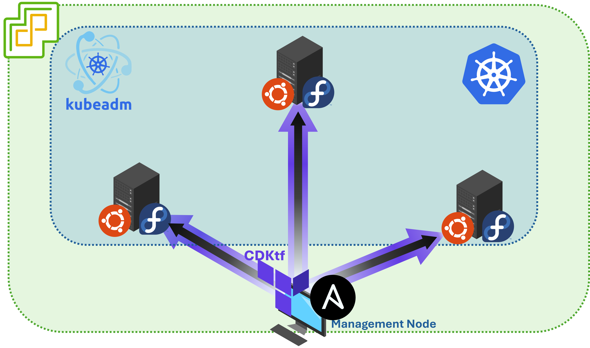

# **CDKTF for Kubernetes on VMWare VSphere**
This repo is a [***cdktf***](https://developer.hashicorp.com/terraform/cdktf) project to create a [*kubeadm*](https://kubernetes.io/docs/reference/setup-tools/kubeadm/) based **Kubernetes**.  


# **Explaination**
The CDKTF wraps the *Terraform* utility to create Linux (fedora or ubuntu) vms in a Vmware vSphere environment and prepare them with tools and configuration to host the kubeadm/kubernetes cluster.  
After that a *Docker* container running an [**Ansible**](https://www.ansible.com) playbook bring up the cluster and further configure it.

## **Prerequisites**
To be able to run this project you need
- An ESXi host with Vcenter configured
- The machine running the project must have access to machine OVAs prepared to be configured with [**cloud-init**](https://cloud-init.io)
    - The `.ova` file must be placed in the `$HOME/<ovaFolder>` folder, where *ovaFolder* value can be configured with an environment variable
    - The name of the OVA file should be renamed following the format of `<osFamily>-<osVersion>-server.ova`, where *osFamily* can be `fedora` or `ubuntu` for example *fedora-40-server.ova* (See below the support matrix for version tested)
- The management machine, where this repo will be loaded and run, must ship following tools with it:
    - [Node.js](https://nodejs.org/en) or equivalent JS runtime environment
    - [Terraform](https://www.terraform.io)
    - [Docker](https://www.docker.com)

## **Usage**
To use this repo you must 
- Feed some configurations.  
    This can be done via environment variables or using the `.env` file (the `.env.mock` file provided can be used as a starting point)
- Run the following command from the repo root
    ```bash
    $ npm install
    $ npm run up
    ```
- Once the installation is complete you can use the file `test-k8s.yaml` to ensure every addons work.  
    (This file will create a *Deployment* exposed with a *LoadBalancer service* and a *Ingress* over it. Moreover will use a *PersistentVolumeClaim* to request 1Gi of *PersistentVolume*)
- wait for completion

## **What's inside**
This repo will install a *kubeadm* based kubernetes cluster.  
Moreover will add to the basic installation
- [**MetalLB**](https://metallb.universe.tf) for *LoadBAlancer* service.  
    (Configured with *L2Advertisement*)
- [**Nginx Ingress Controller**](https://docs.nginx.com/nginx-ingress-controller/) for *Ingress* resources 
- [**Metric Server**](https://kubernetes-sigs.github.io/metrics-server/)
- [**OpenEBS LVM volume provisioning**](https://openebs.io/docs/user-guides/local-storage-user-guide/local-pv-lvm/lvm-installation) and related *StorageClass* to use dynamic storage provisioning

The first control plane node will be also configured to use **kubectl** as *admin* towards the cluster and with [**Helm**](https://helm.sh) utility.  
To make the usage smoother autocompletion and alias has been configured here as per [kubectl reference](https://kubernetes.io/docs/reference/kubectl/quick-reference/)

## **Clean up**
To clean every created reasources just run from the the repo root
```bash
$ npm run down
```
## OS Support Matrix
At the moment the project was successfully tested with 
- fedora 39
- fedora 40
- ubuntu 22.04
- ubuntu 24.04